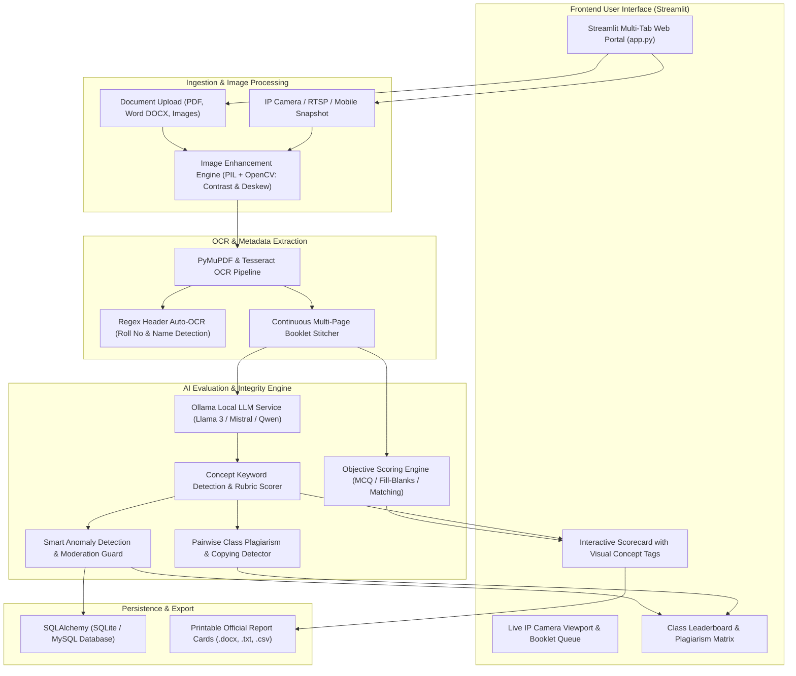

# 🎓 PROJECT SYNOPSIS

## 1. Project Title
**AI-OSM: AI-Powered Smart On-Screen Marking (OSM) & Automated Student Answer Sheet Evaluator Pro**

---

## 2. Project Domain & Category
- **Domain:** Artificial Intelligence (AI), Computer Vision (CV), Natural Language Processing (NLP) / Large Language Models (LLM), and Educational Technology (EdTech).
- **Project Type:** Automated Examination Assessment, On-Screen Marking, Digital Paper Digitization, and Academic Integrity Analytics.

---

## 3. Abstract / Executive Summary
Manual evaluation of examination answer sheets in educational institutions and university examination boards is an intensive, error-prone, and time-consuming process prone to evaluator fatigue and grading inconsistencies. Furthermore, traditional Optical Mark Recognition (OMR) systems are restricted to rigid bubble sheets, requiring expensive proprietary scanning hardware.

**AI-OSM** is an end-to-end intelligent On-Screen Marking and answer sheet evaluation platform designed to bridge physical paper examinations and automated digital grading. Built with an interactive, responsive **Streamlit** frontend user interface, the system connects directly to physical imaging sources—including smartphone IP cameras (HTTP/RTSP), webcams, and multi-format document uploads (PDF, DOCX, PNG, JPG). 

The platform utilizes advanced computer vision algorithms (auto-deskew, contrast enhancement) and Optical Character Recognition (OCR) via PyTesseract and PyMuPDF to extract text and auto-detect student metadata (Roll Number and Candidate Name). Grading is executed via a dual-mode engine: (1) **Descriptive/Theory Evaluation** using Ollama Local LLMs (Llama 3, Mistral, Qwen, Phi-3) with concept keyword matching, rubric-based partial marking, and semantic NLP fallback, and (2) **Objective/OMR Evaluation** (MCQ, True/False, Fill in the Blanks, Match the Column) with configurable negative marking. The system also introduces batch academic integrity features, including a pairwise **Class Plagiarism Matrix** and an automated **Anomaly Detection Engine** that flags scoring variances and routes ambiguous evaluations to human moderators.

---

## 4. Problem Statement & Motivation
In conventional examination assessment workflows, academic institutions face major challenges:
1. **Evaluator Fatigue & Subjectivity:** Grading hundreds of handwritten theoretical answer sheets leads to cognitive fatigue, inconsistent score distributions, and human error.
2. **Slow Evaluation Turnaround:** Manual marking causes delays of weeks or months in publishing institutional examination results.
3. **Hardware Lock-in & High Costs:** Standard OMR sheets require expensive specialized hardware scanners and heavy-stock custom paper, making them inaccessible for routine classroom assessments.
4. **Unchecked Answers & Overlooked Pages:** Evaluators frequently miss unattempted or skipped sub-questions during rapid manual paper-flipping.
5. **Lack of Plagiarism & Collusion Detection:** Manual grading across multiple batches cannot reliably detect verbatim answer copying or collusion between students seated in the same exam hall.

---

## 5. Project Objectives
- **Zero Hardware Lock-In:** Enable high-speed answer sheet capture via ubiquitous IP camera streams (HTTP/RTSP), mobile devices, and USB webcams without dedicated scanner machines.
- **Accurate Document Digitization:** Implement an automated OCR pipeline with pre-processing (contrast boosting, sharpening, deskewing) and regex-based header detection for student identity extraction.
- **Intelligent Dual-Mode Assessment:**
  - *Descriptive/Theory Evaluation:* Leverage LLMs and semantic concept matching to score student answers against master keys, highlighting identified vs. missing concepts.
  - *Objective Evaluation:* Score multi-type objective questions (MCQs, Fill-in-the-Blanks, Match the Column) with negative marking controls.
- **Human-in-the-Loop & Anomaly Moderation:** Prevent unchecked question submissions and flag large discrepancies (>25% score divergence) between AI suggestions and examiner grades for moderation.
- **Academic Integrity & Class Analytics:** Compute a pairwise plagiarism matrix across classroom batches, rank top performers on a real-time leaderboard, and generate official downloadable report cards (`.docx`, `.txt`, `.csv`).

---

## 6. System Architecture & Workflow

---

## 7. Technology Stack

| Layer / Subsystem | Technology / Library | Purpose & Responsibility |
|---|---|---|
| **Frontend UI** | **Streamlit Pro** (`app.py`) | Interactive web application, real-time live camera viewport, multi-tab navigation, dynamic metric cards, interactive progress bars, and visual concept tag rendering. |
| **Backend API Server** | **FastAPI + Uvicorn** (`backend/app/main.py`) | Asynchronous RESTful API framework for ingestion, OCR jobs, camera testing, evaluation endpoints, and moderation case routing. |
| **Database & ORM** | **SQLAlchemy + SQLite / MySQL** | Dual-database persistence layer storing exams, questions, rubrics, answer sheet records, evaluation scores, and moderation logs. |
| **Camera Connectivity** | **Python `urllib` / OpenCV / HTTP Request Handler** | Connects to network IP cameras (IP Webcam, ESP32-CAM, RTSP feeds, USB webcams) for 1-click sub-second snapshot capturing. |
| **Document Processing & OCR** | **PyMuPDF (`fitz`), `python-docx`, PyTesseract** | Direct vector text extraction from native PDFs, XML parsing for DOCX master keys/sheets, and OCR transcription for scanned paper images. |
| **Computer Vision Pre-processing** | **Pillow (`PIL.ImageEnhance`), OpenCV** | Image contrast enhancement (+45%), sharpening filters, and deskewing to ensure optimal OCR transcription accuracy. |
| **AI Evaluation & NLP** | **Ollama Local LLMs (`llama3`, `mistral`, `qwen`, `phi3`) + Scikit-Learn TF-IDF** | Privacy-first local LLM inference engine combined with cosine semantic similarity and keyword concept matching. |
| **Plagiarism Engine** | **Python `difflib.SequenceMatcher`** | Computes pairwise text similarity matrices across student cohorts to identify answer copying. |
| **Reporting & Export** | **Python `docx`, Pandas, CSV** | Dynamic compilation of official institutional report cards and batch class performance summaries. |

---

## 8. Key Features & Modules

### 8.1. Streamlit Modern Frontend Interface
- **Hero Dashboard & Multi-Tab Layout:** Designed with a modern, high-contrast aesthetic utilizing Google Fonts (*Plus Jakarta Sans*, *Outfit*), dark-mode styling, and structured tabs:
  1. `📹 IP Camera & Booklet Scan`
  2. `1️⃣ Student Info & Master Key (PDF, DOCX, TXT)`
  3. `2️⃣ Upload / Capture Student Sheet`
  4. `3️⃣ Scorecard & Report Card`
  5. `4️⃣ Class Analytics & Plagiarism Matrix 🏆`
- **Dynamic Feedback & Visual Highlighters:** Displays answers with inline HTML color highlights (Green for matched key concepts, Red for missing concepts).

### 8.2. IP Camera Streaming & Multi-Page Continuous Scanning
- **Zero Hardware Barrier:** Connects to mobile IP camera apps (e.g., *IP Webcam*), ESP32-CAM modules, RTSP surveillance cameras, or desktop webcams.
- **Continuous Booklet Assembly:** Allows sequential snapshotting of Page 1, Page 2, Page 3, automatically stitching multi-page answer booklets into a single student record.

### 8.3. Header Auto-OCR & Document Ingestion
- **Automatic Identity Detection:** Scans the upper region of the paper using regex pattern extractors to automatically parse the Student Roll Number and Candidate Name, eliminating manual clerical data entry.
- **Multi-Format Master Key Ingestion:** Accepts master answer keys uploaded as Word documents (`.docx`), PDFs (`.pdf`), text files (`.txt`), JSON structures, or paper photos.

### 8.4. Dual Evaluation Modes
- **Mode A: Full Content / Descriptive Theory Examination:**
  - Evaluated against model answers and rubric criteria.
  - Powered by local Ollama LLMs (Llama 3, Mistral, Qwen, Phi-3) with resilient semantic NLP fallback.
  - Calculates accuracy percentage, assigns recommended letter grades (A+, A, B, C, D), and provides constructive AI commentary.
- **Mode B: Objective / OMR Examination:**
  - Evaluates MCQs, True/False, Fill in the Blanks, One-Word answers, and Match the Column questions.
  - Supports custom positive marks and deduction rules for negative marking.

### 8.5. Academic Integrity & Class Plagiarism Matrix
- **Pairwise Cohort Analysis:** Analyzes student submissions across an entire class batch to identify identical text structures.
- **Similarity Matrix:** Generates an automated cross-comparison matrix highlighting pairs with high text overlap (`HIGH SIMILARITY 🔴`), alerting educators to potential copying.

### 8.6. Anomaly Detection & Moderation Workflow
- **Unchecked Question Guard:** Blocks evaluation finalization if any question remains ungraded.
- **Variance Anomaly Engine:** Detects significant discrepancies (>25% variance) between examiner-assigned marks and AI model recommendations, automatically routing flagged sheets to an administrative moderation queue.

### 8.7. Automated Report Card Generation
- Instant preview of institutional report cards complete with evaluator signature sections, student metrics, and question-by-question feedback.
- One-click export to printable `.docx`, `.txt`, and class-level `.csv` formats.

---

## 9. System Requirements

### Hardware Requirements
- **Processor:** Intel Core i5 / AMD Ryzen 5 or higher (Quad-core minimum).
- **RAM:** 8 GB minimum (16 GB recommended for running local Ollama LLMs).
- **Storage:** 500 MB free disk space for application files, models, and OCR cache.
- **Camera (Optional for live capture):** Standard USB Webcam (720p/1080p), Smartphone with IP Webcam App, or RTSP Network Camera.

### Software Requirements
- **Operating System:** Windows 10/11, macOS, or Linux (Ubuntu 20.04+).
- **Programming Language:** Python 3.9, 3.10, or 3.11.
- **Core Dependencies:** `streamlit`, `fastapi`, `uvicorn`, `PyMuPDF`, `python-docx`, `pytesseract`, `pillow`, `scikit-learn`, `sqlalchemy`.
- **OCR Engine:** Tesseract-OCR binary installed on host system.
- **Web Browser:** Google Chrome, Mozilla Firefox, Microsoft Edge, or Safari.

---

## 10. Expected Outcomes & Impact
1. **Grading Speed:** Reduces grading time by up to **80–90%**, slashing per-sheet evaluation from 10–15 minutes to under 30 seconds.
2. **Standardization & Fairness:** Minimizes evaluator subjectivity by anchoring marking to rubric-based key concept extraction and LLM semantic alignment.
3. **Institutional Cost Savings:** Eliminates the necessity for specialized OMR scanner machines and custom paper sheets.
4. **Enhanced Academic Integrity:** Uncovers hidden cheating rings and student answer sharing through automated batch plagiarism detection.
5. **Immediate Feedback Delivery:** Provides students with detailed question breakdowns, highlighting exactly which concepts were successfully explained and which were missed.

---

## 11. Conclusion
The **AI-OSM Student Answer Sheet Evaluator** represents a scalable, hardware-independent leap in educational assessment technology. By utilizing **Streamlit** to deliver an intuitive, responsive frontend dashboard coupled with robust Python OCR and LLM evaluation pipelines, the platform empowers educators and universities to grade examinations faster, eliminate clerical errors, detect academic dishonesty, and uphold transparent evaluation standards.
